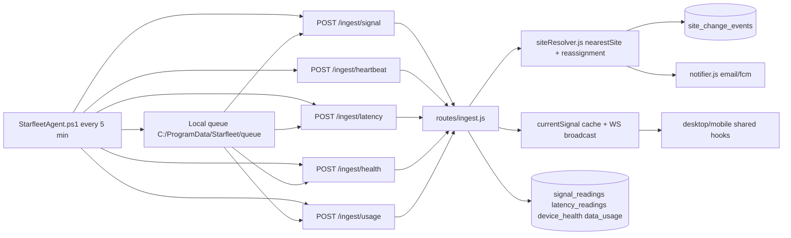

# Weather and Laptop Dataflow Blueprint (Immediate Next Work)

## Purpose
This blueprint defines the next implementation wave for how the platform ingests laptop telemetry and weather intelligence, then fuses both into actionable diagnosis outputs.

## Scope and Assumptions
- Scope: backend + agent + shared consumers for laptop/weather data flow.
- `laprops` is treated as `laptops`.
- Source of truth: repository implementation on `main`.
- Goal: close known `PARTIAL` gaps and raise data-path reliability.

## Current End-to-End Flow

### Laptop telemetry ingestion flow


### Weather intelligence flow
```mermaid
flowchart LR
  N[NOAA K-index API] --> O[services/spaceWeather.js]
  P[Open-Meteo daily API] --> R[services/weatherCorrelation.js]
  S[CelesTrak TLE feed] --> T[services/orbitalSync.js]

  O --> U[(space_weather)]
  R --> V[(weather_log)]
  T --> W[(satellite_tles)]

  U --> X[services/scoreCron.js getEnhancedDiagnosis]
  W --> X
  V -. intended cause annotation .-> X

  X --> Y[(daily_scores cause/anomaly/data_quality)]
  Y --> Z[/api/sites and /api/sites/:id/signal consumers]
```

## Gap List and Priority

### P0 (must close first)
1. Wire weather annotation into scoring cause output.
- Files: `packages/backend/services/scoreCron.js`, `packages/backend/services/weatherCorrelation.js`.
- Current gap: `annotateCauseWithWeather()` exists but is never called in score computation path.
- Acceptance: when rain/cloud thresholds are met, stored `daily_scores.cause` includes weather context.

2. Restore mobile push path from backend notifications.
- Files: `packages/mobile/src/hooks/useFCM.ts`, `packages/mobile/src/navigation/RootNavigator.tsx`, backend notifier path in `packages/backend/services/notifier.js`.
- Current gap: mobile hook is a no-op.
- Acceptance: push arrives and deep-link opens relevant screen.

3. Fix desktop map source corruption blocking type-check.
- File: `packages/desktop/src/components/MapView.tsx`.
- Current gap: invalid characters break `tsc`.
- Acceptance: `npm run type-check --workspace=packages/desktop` passes.

4. Fix mobile type-check wiring and websocket client mismatch.
- Files: `packages/mobile/package.json`, `packages/mobile/src/store/auth.ts`, `packages/shared/src/ws-client.ts`.
- Current gap: mobile type-check script/config does not run project check; auth uses stale websocket constructor pattern.
- Acceptance: mobile type-check runs cleanly and websocket connects via shared client API.

### P1 (high value reliability)
1. Add ingest idempotency keys for replayed payloads.
- Files: `packages/agent/StarfleetAgent.ps1`, `packages/backend/routes/ingest.js`, new migration for unique ingest keys.
- Acceptance: replayed queued payload does not duplicate telemetry rows.

2. Add ingestion observability for queue depth and ingest failures.
- Files: `packages/agent/StarfleetAgent.ps1`, backend ingest logging path.
- Acceptance: operator can see queue growth and endpoint failure rate.

3. Add weather visibility endpoint for UI diagnostics.
- Files: `packages/backend/routes/api.js` (extend `/api/intel/space-weather` usage or add site-weather endpoint), shared/mobile/desktop consumers.
- Acceptance: UI can show recent weather context used for diagnosis.

### P2 (cleanup and maintainability)
1. Consolidate mobile directory structure to one canonical package path.
- Files: `packages/mobile` and nested `packages/mobile/android` mirror.
- Acceptance: one source tree remains and build scripts/docs point to it consistently.

2. Add backend static analysis/type-check script baseline.
- Files: `packages/backend/package.json`.
- Acceptance: backend has a repeatable quality gate in CI/local checks.

## Implementation Queue (Execution Order)
1. P0.1 Weather annotation integration + tests.
2. P0.3 Desktop map fix + desktop type-check.
3. P0.4 Mobile type-check + websocket alignment.
4. P0.2 Mobile FCM restoration and deep-link validation.
5. P1.1 Ingest idempotency keys.
6. P1.2 Ingest observability enhancements.
7. P1.3 Weather diagnostics API and UI hookup.
8. P2 cleanup tasks.

## Concrete Test Plan

### Verification commands
- `npm run type-check --workspace=packages/shared`
- `npm run type-check --workspace=packages/desktop`
- `npm run type-check --workspace=packages/mobile`

### Functional tests
1. Weather-cause integration test
- Seed `weather_log` for site/day with heavy rain.
- Run score cron for that site/day.
- Assert `daily_scores.cause` includes rain/cloud annotation.

2. Laptop replay idempotency test
- Submit same queued payload twice with same ingest key.
- Assert only one telemetry record persists.

3. Push notification smoke test
- Trigger `site_change_events` notification.
- Assert mobile receives push and deep-link route opens.

4. Desktop map regression test
- Run desktop type-check and app launch after map fix.
- Assert map renders with selectable sites.

## Definition of Done for this focus
- Weather context is part of persisted diagnosis output where applicable.
- Laptop queue replay is idempotent and auditable.
- Desktop and mobile quality gates run successfully.
- Push path works end to end again.
