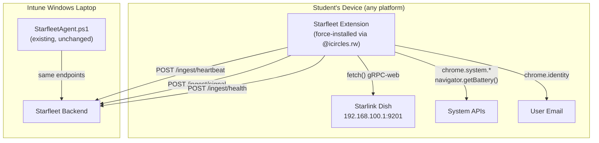

# Chromebook & Non-Intune Device Integration — Starfleet Extension

## Background

You have three categories of student devices using Starlink connectivity across your iCircles sites:

| Tier | Devices | Current coverage |
|---|---|---|
| **Tier 1** | ~280 Intune-enrolled Windows laptops | ✅ PowerShell agent + Intune server sync |
| **Tier 2** | ~200 Chromebooks + unknown number of non-Intune school laptops | ❌ No visibility today |
| **Tier 3** | Phones, tablets, guests | ❌ Residual bucket (always estimated) |

All Tier 2 students sign into Chrome with `@icircles.rw` accounts under the **"Isomo circles" OU** in your Google Workspace (Education Fundamentals, no Chrome Education Upgrade). Chromebooks are shared between students.

**Goal**: Bring Tier 2 into Starfleet with the same site-level and device-level visibility as Tier 1 — without purchasing licenses or enrolling devices.

## Solution: Managed Chrome Extension

A lightweight Chrome Extension, force-installed via Google Workspace user policy, acts as a cross-platform agent. It installs automatically on **any device** where a student signs into Chrome with their `@icircles.rw` account — Chromebooks, non-Intune Windows laptops, school Macs, anything.



### Why this works without Chrome Education Upgrade

- **User-level extension policy** is included in Workspace for Education Fundamentals (your current plan)
- Extensions force-installed via user policy apply when a user signs into Chrome **on any device or OS** — not just enrolled ChromeOS devices
- No Google Cloud project, no service account, no API quotas needed for deployment
- The extension uses only standard Chrome Extension APIs and Web APIs — no enterprise-only permissions

### What the extension collects

| Data point | API used | Maps to backend endpoint | Notes |
|---|---|---|---|
| Starlink UUID | `fetch()` → `192.168.100.1:9201` gRPC-web | `/ingest/signal` `starlink_id` | Same binary payload as Windows agent |
| Starlink GPS lat/lon | Same gRPC response, offset parsing | `/ingest/signal` `lat`, `lon` | Site auto-discovery, same as Windows |
| Battery % + charging | `navigator.getBattery()` | `/ingest/health` `battery_pct` | Standard Web API |
| RAM total / available | `chrome.system.memory.getInfo()` | `/ingest/health` `ram_used_mb`, `ram_total_mb` | Extension API |
| CPU model + usage | `chrome.system.cpu.getInfo()` | `/ingest/health` (new fields) | Extension API |
| Storage capacity / free | `chrome.system.storage.getInfo()` | `/ingest/health` `disk_free_gb`, `disk_total_gb` | Extension API |
| Signed-in user email | `chrome.identity.getProfileUserInfo()` | `user_principal_name` on device record | Extension API |
| Device fingerprint | Hash of (CPU + RAM + screen + OS + platform) | `device_sn` (synthetic identifier) | Stable across user sessions on same hardware |
| OS and platform | `navigator.userAgent` / `navigator.platform` | `os`, `model` on device record | Distinguishes ChromeOS vs Windows vs Mac |
| Heartbeat / liveness | `chrome.alarms` every 5 min | `/ingest/heartbeat` | Same cadence as Windows agent |

### What the extension does NOT collect (and why that's fine)

| Missing vs Windows agent | Why it's OK |
|---|---|
| **Per-device data usage (bytes)** | Falls into existing "unmanaged residual" calculation. Windows agents at same site already report Starlink dish throughput. |
| **Disk SMART status** | Not exposed by ChromeOS. Battery health is a better indicator for Chromebooks anyway. |
| **Latency measurements** | Could add `fetch()` timing to known endpoints later. Not critical for MVP. |

## Shared Chromebook Identity Strategy

Since Chromebooks are shared, multiple students use the same hardware. The extension handles this with a **device fingerprint**:

```
fingerprint = SHA-256(
    cpuModel + cpuCores +
    totalRAM +
    screenWidth + screenHeight +
    platform + osMajorVersion
)
```

- This produces a stable identifier per physical machine, regardless of which user is signed in
- Used as `device_sn` when posting to backend (prefixed `CB-` to distinguish from BIOS serials)
- The backend's existing `autoRegisterDevice()` upserts on `device_sn`, so the first student to sign in registers the device, subsequent students just update `last_seen` and `user_principal_name`
- `user_principal_name` always reflects the **currently signed-in** student

> [!NOTE]
> The fingerprint isn't guaranteed unique if two identical Chromebooks exist (same model, same RAM, same screen). In practice, this is rare enough to not matter for site-level analytics. If it becomes an issue later, we can add a locally-persisted random component via `chrome.storage.local`.

## Auth Strategy

> [!IMPORTANT]
> **Recommended: Same bootstrap flow as Windows agent.**
>
> The extension uses the existing `/ingest/bootstrap-token` endpoint:
> 1. On first run, extension is configured with the **discovery token** (site_id=0), same as Windows agents
> 2. Extension queries the Starlink dish for UUID + GPS
> 3. Extension calls `POST /ingest/bootstrap-token` with `device_sn` (fingerprint), Starlink identity, and GPS
> 4. Backend resolves site from Starlink UUID or GPS, returns a site-scoped JWT
> 5. Extension stores the JWT in `chrome.storage.local` and uses it for all subsequent `/ingest/*` calls
>
> This means **zero backend auth changes** needed. The extension is just another agent that speaks the same protocol.

## Extension Architecture

```
starfleet-extension/
├── manifest.json          # Extension manifest v3
├── background.js          # Service worker — scheduling, auth, Starlink gRPC
├── lib/
│   ├── starlink.js        # gRPC-web fetch to 192.168.100.1 (binary payload/parse)
│   ├── health.js          # chrome.system.* data collection
│   ├── identity.js        # Fingerprint generation, user email
│   ├── ingest.js          # POST to backend /ingest/* endpoints
│   └── storage.js         # Token + config persistence in chrome.storage.local
├── popup.html             # Minimal popup — shows status, site name, last sync
├── popup.js               # Popup logic
└── icons/
    ├── icon16.png
    ├── icon48.png
    └── icon128.png
```

### manifest.json key permissions

```json
{
  "manifest_version": 3,
  "name": "Starfleet Monitor",
  "permissions": [
    "alarms",
    "identity",
    "identity.email",
    "system.cpu",
    "system.memory",
    "system.storage",
    "storage"
  ],
  "host_permissions": [
    "http://192.168.100.1/*",
    "https://starfleet-backend.your-domain.com/*"
  ],
  "background": {
    "service_worker": "background.js"
  }
}
```

> [!NOTE]
> `host_permissions` for `192.168.100.1` allows the extension to bypass CORS when querying the Starlink dish. Standard web pages cannot do this — only extensions with declared host permissions.

## Proposed Changes

### Extension Package

#### [NEW] `packages/extension/` — Starfleet Chrome Extension

Full extension package as described above. Key components:

- **`background.js`** — Service worker that:
  - Runs every 5 minutes via `chrome.alarms`
  - Collects system health, queries Starlink dish, posts to backend
  - Handles bootstrap token exchange on first run
  - Stores JWT and site config in `chrome.storage.local`

- **`lib/starlink.js`** — Replicates the exact gRPC-web call from `StarfleetAgent.ps1`:
  - Same 9-byte payload: `[0x00, 0x00, 0x00, 0x00, 0x04, 0x82, 0xF7, 0x02, 0x00]`
  - Same offset-based parsing for UUID, lat, lon, azimuth, elevation
  - Returns `{ starlink_id, starlink_uuid, lat, lon }` or `null` if dish unreachable

- **`lib/health.js`** — Collects device health:
  - Battery via `navigator.getBattery()`
  - RAM via `chrome.system.memory.getInfo()`
  - CPU via `chrome.system.cpu.getInfo()`
  - Storage via `chrome.system.storage.getInfo()`

- **`popup.html/js`** — Minimal status popup showing site name, last sync time, connection status

---

### Backend

#### [MODIFY] Runtime schema in [server.js](file:///Users/an0n/Documents/1%20-%20Projects/Isomo%20Tech/Isomo-Pulse/starlink-fleet-monitor/packages/backend/server.js)

Add `device_platform` column to distinguish device types:

```sql
ALTER TABLE devices
  ADD COLUMN IF NOT EXISTS device_platform TEXT DEFAULT 'windows';
```

No new tables, no new routes, no new services. The extension speaks the existing ingest protocol.

#### [MODIFY] [ingest.js](file:///Users/an0n/Documents/1%20-%20Projects/Isomo%20Tech/Isomo-Pulse/starlink-fleet-monitor/packages/backend/routes/ingest.js) `autoRegisterDevice()`

Accept optional `platform` field in heartbeat/health payloads. Set `device_platform` on insert:
- `'windows'` for PowerShell agent (default, backward compatible)
- `'chromeos'` or `'chrome_extension'` for extension check-ins
- Detected from `os` field or explicit `platform` field in payload

#### [MODIFY] [api.js](file:///Users/an0n/Documents/1%20-%20Projects/Isomo%20Tech/Isomo-Pulse/starlink-fleet-monitor/packages/backend/routes/api.js)

- Add `device_platform` to device list API responses
- Add optional `?platform=chromeos|windows|all` query filter

#### [MODIFY] [.env.example](file:///Users/an0n/Documents/1%20-%20Projects/Isomo%20Tech/Isomo-Pulse/starlink-fleet-monitor/packages/backend/.env.example)

No new env vars needed for the extension itself. The extension connects to the same backend URL and uses the same JWT auth.

---

### Deployment (Admin Console — manual, done by you)

1. Upload extension to Chrome Web Store as **unlisted** (only installable via direct link or policy)
2. In Google Admin Console:
   - Navigate to **Apps & extensions → Chrome → Users & browsers**
   - Select **"Isomo circles"** OU
   - Click ➕ → **Add from Chrome Web Store** → enter extension ID
   - Set installation policy to **"Force install"**
3. Set the backend URL and discovery token as managed extension configuration via Admin Console (the extension reads these from `chrome.storage.managed`)

```json
{
  "backendUrl": { "Value": "https://starfleet-backend.icircles.rw" },
  "discoveryToken": { "Value": "eyJhbG..." }
}
```

> [!TIP]
> **Alternative to Chrome Web Store**: You can self-host the extension `.crx` file and distribute via policy URL. This avoids the Chrome Web Store review process entirely. However, force-install from Web Store is more standard and auto-updates are handled by Chrome.

## Open Questions

> [!IMPORTANT]
> 1. **Backend URL**: Is the backend deployed at `starfleet-backend.icircles.rw`, or a different hostname? The extension needs to know where to POST.
> 2. **Chrome Web Store vs self-hosted**: Do you have a Chrome Web Store developer account ($5 one-time fee), or do you prefer to self-host the extension?
> 3. **Extension popup branding**: Should the popup show "Starfleet" / "iCircles" / "Isomo" branding? Want me to generate an icon?

## Verification Plan

### Phase 1: Extension Build & Local Testing
1. Build extension, load unpacked in Chrome on your Mac
2. Verify it queries the Starlink dish successfully (if you're on a Starlink network) or gracefully handles dish-not-found
3. Verify it collects battery/RAM/CPU/storage
4. Verify it posts to local backend and device appears in dashboard

### Phase 2: Staging Deployment
1. Upload to Chrome Web Store (unlisted)
2. Force-install on your own `@icircles.rw` account first
3. Verify device appears in Starfleet dashboard with correct site
4. Sign in on a different device with same account — verify the extension installs and reports

### Phase 3: Fleet Rollout
1. Apply policy to entire "Isomo circles" OU
2. Monitor backend for new device registrations
3. Verify site assignment works across multiple sites
4. Check dashboard shows combined Windows + Chrome fleet

## Implementation Phases

### Phase 1 — Core Extension + Backend Column (MVP)
- Build extension with heartbeat, Starlink gRPC query, and health collection
- Add `device_platform` column to backend
- Test locally with unpacked extension
- **Deliverable**: One Chromebook visible in dashboard at correct site

### Phase 2 — Auth & Deployment
- Implement bootstrap token flow in extension
- Upload to Chrome Web Store (unlisted)
- Configure managed settings (backend URL, discovery token)
- Force-install on test account
- **Deliverable**: Extension auto-installs and self-configures

### Phase 3 — Fleet Rollout & UI
- Apply to "Isomo circles" OU
- Add platform icon/filter to web dashboard
- Add combined fleet analytics
- **Deliverable**: Full fleet visibility — Windows + ChromeOS + non-Intune devices
