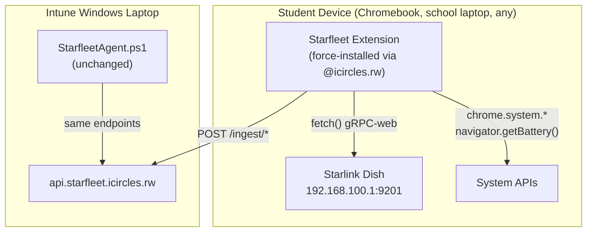

# Chromebook & Non-Intune Device Integration — Starfleet Extension

## Confirmed Decisions

| Decision | Answer |
|---|---|
| Backend URL | `https://api.starfleet.icircles.rw` |
| Distribution | Self-hosted (no Chrome Web Store) |
| Device identifier | `device_sn` (serial number) — no synthetic fingerprint |
| Platform flag | Simple `device_platform`: `'windows'` or `'chromebook'` — no version tracking |
| On-install behavior | Open welcome tab → "Welcome to Isomo Circles" → 5s → redirect to `https://www.isomo-rw.com/isomo-circles/` |
| Branding | Isomo Circles — teal/navy icon generated |
| Auth | Same bootstrap token flow as Windows agent |

## Background

Three tiers of student devices across iCircles sites:

| Tier | Devices | Coverage |
|---|---|---|
| **Tier 1** | ~280 Intune-enrolled Windows laptops | ✅ PowerShell agent + Intune sync |
| **Tier 2** | ~200 shared Chromebooks + non-Intune school laptops | ❌ → **this plan** |
| **Tier 3** | Phones, tablets, guests | Residual bucket (estimated) |

All Tier 2 students sign into Chrome with `@icircles.rw` accounts under the **"Isomo circles" OU**. Chromebooks are shared, all same model/OS. No Chrome Education Upgrade license.

## Solution: Self-Hosted Managed Chrome Extension



### What the extension collects

| Data | API | Backend endpoint |
|---|---|---|
| Starlink UUID + GPS | `fetch()` → `192.168.100.1:9201` gRPC-web | `/ingest/signal` |
| Battery % | `navigator.getBattery()` | `/ingest/health` |
| RAM total/available | `chrome.system.memory.getInfo()` | `/ingest/health` |
| CPU info | `chrome.system.cpu.getInfo()` | `/ingest/health` |
| Storage free/total | `chrome.system.storage.getInfo()` | `/ingest/health` |
| User email | `chrome.identity.getProfileUserInfo()` | `user_principal_name` |
| Heartbeat | `chrome.alarms` every 5 min | `/ingest/heartbeat` |

## Device Identity: Serial Number Caveat

> [!WARNING]
> **ChromeOS only exposes the hardware serial number via `chrome.enterprise.deviceAttributes.getDeviceSerialNumber()`, which requires the device to be enterprise-enrolled (Chrome Education Upgrade).** Since you don't have that license, the extension cannot read the serial directly.
>
> **Workaround**: On first install, the extension generates a stable UUID and stores it in `chrome.storage.local`. This becomes the `device_sn` (prefixed `CB-` to distinguish from Windows BIOS serials). Since all Chromebooks are the same model, a hardware fingerprint would collide across devices — a generated UUID is more reliable.
>
> **Trade-off**: `chrome.storage.local` is per-user-profile. On a shared Chromebook, each student's profile gets its own UUID. This means the same physical Chromebook may appear as multiple "devices" in the backend. However:
> - Site assignment is still correct (all users on the same Chromebook see the same Starlink UUID)
> - Health data (battery, RAM) is still accurate
> - You can see which students are active at which sites
> - The backend tracks `user_principal_name` so you can group by user
>
> If you later purchase Chrome Education Upgrade, we can swap in the real serial number with a one-line change.

## On-Install Welcome Experience

When the extension installs for the first time, it:

1. Opens a new tab with a branded **"Welcome to Isomo Circles"** page
2. Shows the Isomo Circles branding with the Starfleet icon for **5 seconds**
3. Automatically redirects to `https://www.isomo-rw.com/isomo-circles/`

The welcome page is bundled inside the extension (no external dependency for the initial display). Built as `welcome.html` with:
- Dark gradient background (navy → teal, matching the icon)
- Isomo Circles logo/name centered
- Subtle pulse animation on the icon
- "Connecting you to the Starfleet network..." subtext
- Smooth fade-out transition before redirect

## Extension Architecture

```
packages/extension/
├── manifest.json            # Manifest V3
├── background.js            # Service worker: scheduling, auth, data collection
├── welcome.html             # On-install welcome page (5s → redirect)
├── welcome.js               # Welcome page redirect logic
├── welcome.css              # Welcome page styling
├── popup.html               # Toolbar popup: status, site, last sync
├── popup.js
├── popup.css
├── lib/
│   ├── starlink.js          # gRPC-web binary fetch + UUID/GPS parsing
│   ├── health.js            # Battery, RAM, CPU, storage collection
│   ├── identity.js          # UUID generation, user email lookup
│   ├── ingest.js            # POST to api.starfleet.icircles.rw/ingest/*
│   └── storage.js           # Token + device UUID persistence
└── icons/
    ├── icon16.png
    ├── icon48.png
    └── icon128.png
```

### manifest.json

```json
{
  "manifest_version": 3,
  "name": "Isomo Circles — Starfleet Monitor",
  "version": "1.0.0",
  "description": "Network monitoring for Isomo Circles students",
  "permissions": [
    "alarms",
    "identity",
    "identity.email",
    "system.cpu",
    "system.memory",
    "system.storage",
    "storage"
  ],
  "host_permissions": [
    "http://192.168.100.1/*",
    "https://api.starfleet.icircles.rw/*"
  ],
  "background": {
    "service_worker": "background.js"
  },
  "action": {
    "default_popup": "popup.html",
    "default_icon": {
      "16": "icons/icon16.png",
      "48": "icons/icon48.png",
      "128": "icons/icon128.png"
    }
  },
  "icons": {
    "16": "icons/icon16.png",
    "48": "icons/icon48.png",
    "128": "icons/icon128.png"
  }
}
```

## Self-Hosting the Extension

Since you're not using Chrome Web Store, here's how self-hosting works:

### Step 1: Host the extension files

After building the extension, you'll have a directory with all the files. You need to:

1. Create a `.crx` file (signed extension package) OR host the raw files as a `.zip`
2. Create an `updates.xml` file that Chrome checks for new versions
3. Host both on any HTTPS server you control (e.g., `https://starfleet.icircles.rw/extension/`)

The `updates.xml` file looks like:
```xml
<?xml version='1.0' encoding='UTF-8'?>
<gupdate xmlns='http://www.google.com/update2/response' protocol='2.0'>
  <app appid='YOUR_EXTENSION_ID_HERE'>
    <updatecheck codebase='https://starfleet.icircles.rw/extension/starfleet-monitor.crx'
                 version='1.0.0' />
  </app>
</gupdate>
```

### Step 2: Configure in Google Admin Console

1. Go to **admin.google.com → Apps & extensions → Chrome → Users & browsers**
2. Select the **"Isomo circles"** OU on the left
3. Click the ➕ button → **"Add from URL"**
4. Enter the URL to your `updates.xml`: `https://starfleet.icircles.rw/extension/updates.xml`
5. Set installation policy to **"Force install"**
6. Under **Policy for extensions**, add managed configuration:
   ```json
   {
     "backendUrl": "https://api.starfleet.icircles.rw",
     "discoveryToken": "<your-discovery-JWT-here>"
   }
   ```

### Step 3: Automatic deployment

Every student who signs into Chrome with their `@icircles.rw` account will get the extension auto-installed. Chrome periodically checks `updates.xml` for new versions — when you update, just bump the version and replace the `.crx` file.

> [!TIP]
> I will include a build script in the extension package that:
> 1. Generates the `.crx` file from the source
> 2. Generates `updates.xml` with the correct version
> 3. Outputs the files ready to upload to your server

## Proposed Changes

### Extension Package

#### [NEW] `packages/extension/` — Complete Chrome Extension

All files listed in the architecture section above. Key behaviors:

- **On install**: Opens `welcome.html` tab (branded welcome, 5s redirect)
- **Every 5 minutes**: Wakes via `chrome.alarms`, collects health + Starlink data, posts to backend
- **On first data cycle**: Requests bootstrap token from `/ingest/bootstrap-token` using discovery JWT
- **Popup**: Shows current site name, connection status, last sync time

---

### Backend

#### [MODIFY] Runtime schema in [server.js](file:///Users/an0n/Documents/1%20-%20Projects/Isomo%20Tech/Isomo-Pulse/starlink-fleet-monitor/packages/backend/server.js)

Add one column:
```sql
ALTER TABLE devices
  ADD COLUMN IF NOT EXISTS device_platform TEXT DEFAULT 'windows';
```

#### [MODIFY] [ingest.js](file:///Users/an0n/Documents/1%20-%20Projects/Isomo%20Tech/Isomo-Pulse/starlink-fleet-monitor/packages/backend/routes/ingest.js)

- `autoRegisterDevice()`: Accept optional `platform` field, store as `device_platform`
- Backward compatible — Windows agent continues working without changes

#### [MODIFY] [api.js](file:///Users/an0n/Documents/1%20-%20Projects/Isomo%20Tech/Isomo-Pulse/starlink-fleet-monitor/packages/backend/routes/api.js)

- Include `device_platform` in device list responses
- Add optional `?platform=` filter

---

## Icon


Will be resized to 16×16, 48×48, and 128×128 for the extension manifest.

---

## Verification Plan

### Phase 1: Local Testing
- Load extension unpacked in Chrome on your Mac
- Verify welcome tab opens on install with correct branding and redirect
- Verify health data collection (battery, RAM, CPU, storage)
- Verify Starlink gRPC query works (or graceful fallback when not on Starlink)
- Verify POST to `api.starfleet.icircles.rw` succeeds

### Phase 2: Staging
- Build `.crx`, host on your server with `updates.xml`
- Force-install on your own `@icircles.rw` account via Admin Console
- Verify auto-install, welcome flow, and data appearing in dashboard
- Test on a Chromebook at a site with Starlink

### Phase 3: Fleet Rollout
- Apply to entire "Isomo circles" OU
- Monitor for new device registrations in backend
- Verify site assignment across multiple sites

## Implementation Phases

### Phase 1 — Extension MVP + Backend Column
- Build extension: heartbeat, Starlink gRPC, health collection, welcome tab
- Add `device_platform` column to backend
- Build script for `.crx` + `updates.xml`
- Local testing
- **Deliverable**: Working extension, loadable unpacked

### Phase 2 — Auth + Self-Host Setup
- Bootstrap token flow in extension
- Managed configuration support (backend URL + discovery token)
- Self-hosting documentation + build tooling
- **Deliverable**: Extension installable via Admin Console policy

### Phase 3 — Rollout + UI
- Force-install to "Isomo circles" OU
- Add platform icons/filters to web dashboard
- Combined fleet view (Windows + Chromebook)
- **Deliverable**: Full fleet visibility
